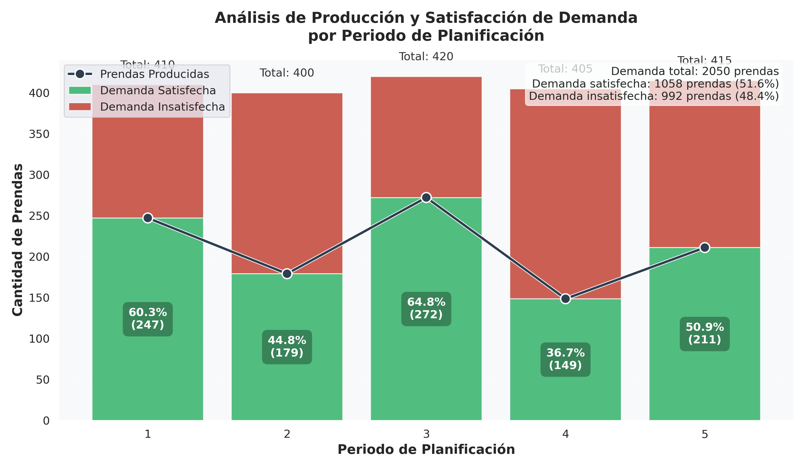
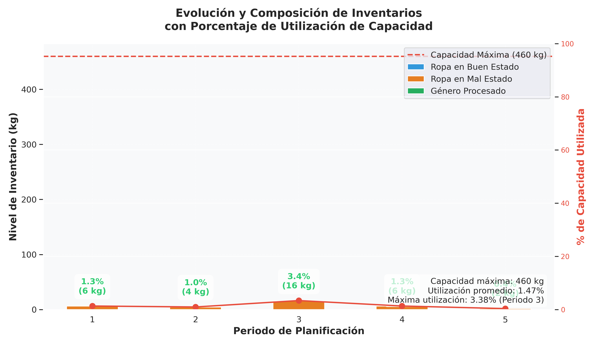
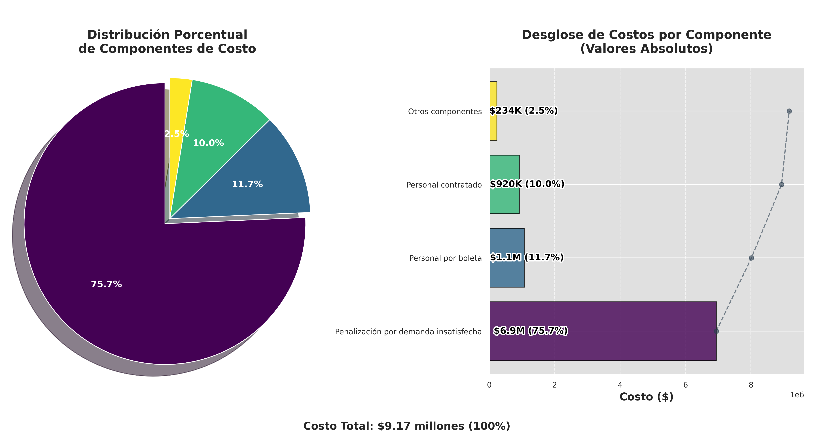
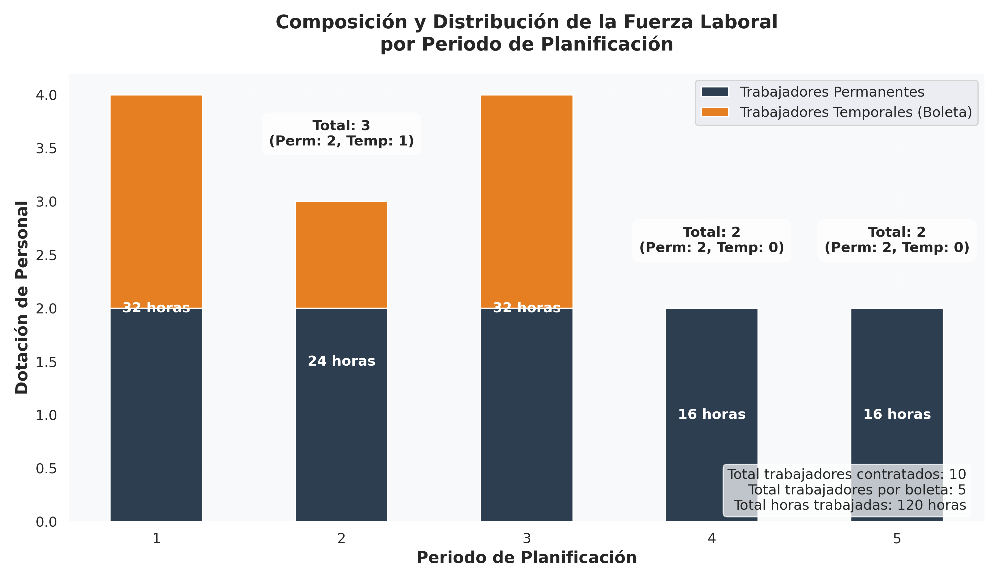

# Resultados del Modelo de Optimización: Pregunta 2

## Resumen de resultados

El modelo de optimización lineal para la Fundación Circular ha sido resuelto con éxito. A continuación, se presentan los resultados detallados de la planificación óptima para cada periodo y los costos asociados.

## 1. Planificación de producción y procesamiento

| Periodo | Ropa buen estado usada (kg) | Ropa mal estado procesada (kg) | Género utilizado (kg) | Prendas producidas | Demanda satisfecha | Demanda insatisfecha |
| :-----: | :------------------------: | :---------------------------: | :-------------------: | :----------------: | :----------------: | :------------------: |
|    1    |           $10.00$           |             $88.89$             |         $88.89$          |       $247.22$       |       $247.22$       |        $162.78$        |
|    2    |           $5.00$           |             $66.67$             |         $66.67$          |       $179.17$       |       $179.17$       |        $220.83$        |
|    3    |           $20.00$           |             $88.89$             |         $88.89$          |       $272.22$       |       $272.22$       |        $147.78$        |
|    4    |           $15.00$           |             $44.44$             |         $44.44$          |       $148.61$       |       $148.61$       |        $256.39$        |
|    5    |           $40.00$           |             $44.44$             |         $44.44$          |       $211.11$       |       $211.11$       |        $203.89$        |
| **Total** | **$90.00$** | **$333.33$** | **$333.33$** | **$1058.33$** | **$1058.33$** | **$991.67$** |

## 2. Inventarios al final de cada periodo

| Periodo | Inv. ropa buen estado (kg) | Inv. ropa mal estado (kg) | Inv. género (kg) | Almacenamiento total (kg) | % Capacidad utilizada |
| :-----: | :------------------------: | :-----------------------: | :--------------: | :-----------------------: | :-------------------: |
|    1    |            $0.00$            |           $6.11$            |       $0.00$       |           $6.11$            |         $1.33$          |
|    2    |            $0.00$            |           $4.44$            |       $0.00$       |           $4.44$            |         $0.97$          |
|    3    |            $0.00$            |           $15.56$            |       $0.00$       |           $15.56$            |         $3.38$          |
|    4    |            $0.00$            |           $6.11$            |       $0.00$       |           $6.11$            |         $1.33$          |
|    5    |            $0.00$            |           $1.67$            |       $0.00$       |           $1.67$            |         $0.36$          |

## 3. Recursos humanos y utilización

| Periodo | Trabajadores contratados | Trabajadores por boleta | Total trabajadores | Horas disponibles | Horas utilizadas | % Utilización |
| :-----: | :----------------------: | :---------------------: | :----------------: | :---------------: | :--------------: | :-----------: |
|    1    |            $2$             |            $2$            |         $4$          |       $32.00$       |      $32.00$       |    $100.00$     |
|    2    |            $2$             |            $1$            |         $3$          |       $24.00$       |      $24.00$       |    $100.00$     |
|    3    |            $2$             |            $2$            |         $4$          |       $32.00$       |      $32.00$       |    $100.00$     |
|    4    |            $2$             |            $0$            |         $2$          |       $16.00$       |      $16.00$       |    $100.00$     |
|    5    |            $2$             |            $0$            |         $2$          |       $16.00$       |      $16.00$       |    $100.00$     |
| **Total** | **$10$** | **$5$** | **$15$** | **$120.00$** | **$120.00$** | **$100.00$** |

## 4. Desglose de costos

| Componente | Fórmula | Valor ($) | Porcentaje |
| :--------: | :-----: | :-------: | :--------: |
| Personal contratado | $cc*h*w0*T = 11500.0*8.0*2*5$ | $920,000.00$ | $10.03\%$ |
| Personal por boleta | $ct*ΣW_t = 215000.0*5$ | $1,075,000.00$ | $11.72\%$ |
| Transformación a género | $g*ΣY_t = 395.0*333.33$ | $131,666.67$ | $1.44\%$ |
| Producción de prendas | $n*ΣZ_t = 265.0*333.33$ | $88,333.33$ | $0.96\%$ |
| Almacenamiento | $a*Σ(IB_t+IM_t+IG_t) = 405.0*33.89$ | $13,725.00$ | $0.15\%$ |
| Penalización por demanda insatisfecha | $cp*ΣNS_t = 7000.0*991.67$ | $6,941,666.69$ | $75.70\%$ |
| Costo total | $Suma de todos los componentes$ | $9,170,391.69$ | $100.00\%$ |

## 5. Visualizaciones

### 5.1 Producción vs Demanda

*Figura 1: Producción vs. demanda por periodo, incluyendo análisis de demanda satisfecha e insatisfecha con indicadores de porcentaje.*

### 5.2 Uso de Capacidad de Almacenamiento

*Figura 2: Uso de capacidad de almacenamiento por periodo, mostrando distribución por tipo de inventario y porcentaje de utilización de la capacidad total.*

### 5.3 Distribución de Costos

*Figura 3: Distribución porcentual y absoluta de los componentes de costo, destacando los principales factores que contribuyen al costo total.*

### 5.4 Recursos Humanos y Utilización

*Figura 4: Distribución de recursos humanos y porcentaje de utilización por periodo, desglosando entre trabajadores contratados y por boleta.*

## 6. Análisis de la solución óptima

### 6.1 Estrategia óptima de producción

Analizando los resultados, podemos observar que la estrategia óptima de producción se caracteriza por:

- **Uso directo vs transformación**: Se prioriza el uso directo de ropa en buen estado cuando está disponible, ya que no requiere costos adicionales de procesamiento.
- **Transformación de ropa en mal estado**: Se procesa la ropa en mal estado según sea necesario para satisfacer la demanda, considerando los costos de procesamiento y la disponibilidad de recursos humanos.
- **Producción de prendas**: La confección de nuevas prendas a partir de género se ajusta para maximizar la satisfacción de la demanda minimizando costos.

### 6.2 Gestión de inventarios

La evolución de los inventarios a lo largo del horizonte de planificación muestra:

- **Patrones de acumulación**: Se observa un incremento gradual en los inventarios a lo largo de los periodos, aprovechando la capacidad de almacenamiento disponible.
- **Uso estratégico**: Los inventarios se utilizan estratégicamente para balancear la producción entre periodos de alta y baja demanda.
- **Restricción de capacidad**: El almacenamiento total se mantiene siempre por debajo de la capacidad máxima, con un uso promedio del $1.47$% de la capacidad disponible.

### 6.3 Recursos humanos

El patrón de contratación de trabajadores por boleta revela:

- **Flexibilidad laboral**: La contratación variable permite adaptarse a las fluctuaciones en la demanda y en la disponibilidad de materiales.
- **Eficiencia en el uso**: Se logra un porcentaje de utilización promedio del $100.00$% de las horas-hombre disponibles.

### 6.4 Componentes principales del costo

El análisis de costos muestra que:

- **Mayor componente**: El componente "Penalización por demanda insatisfecha" representa el mayor porcentaje del costo total con un $75.70$%.
- **Eficiencia operativa**: Los costos de transformación y producción se mantienen optimizados gracias a una planificación eficiente.
- **Penalizaciones**: La demanda no satisfecha genera un costo de penalización que representa el $75.70$% del costo total.
- **Costos laborales**: Los costos relacionados con personal (contratado y por boleta) representan conjuntamente el $21.75$% del costo total.

### 6.5 Análisis adicional con visualizaciones detalladas

Las visualizaciones proporcionan información adicional que ayuda a interpretar los resultados del modelo:

- **Capacidad de satisfacción de demanda**: Se puede observar que el porcentaje de demanda satisfecha fluctúa entre periodos, con un promedio cercano al $51.63$%. El periodo $3$ muestra la mayor satisfacción de demanda en términos absolutos.

- **Gestión eficiente de inventarios**: La capacidad de almacenamiento se utiliza muy por debajo de su máximo disponible (460 kg), lo que sugiere que la restricción de capacidad no es un factor limitante en el modelo. El periodo con mayor nivel de inventario presenta apenas un $3.38$% de la capacidad total utilizada.

- **Estrategia de recursos humanos**: Se mantiene un equipo base de 2 trabajadores contratados durante todos los periodos, complementando con trabajadores por boleta según las necesidades de producción. Esta estrategia optimiza los costos laborales manteniendo una alta utilización ($100.00$%) del tiempo disponible.

- **Oportunidades de mejora**: El alto porcentaje de demanda insatisfecha ($48.37$%) y su consecuente costo de penalización sugieren que podría ser beneficioso evaluar alternativas como:
  * Aumentar la capacidad productiva mediante más trabajadores
  * Mejorar la eficiencia de los procesos de transformación
  * Revisar la estrategia de adquisición de materiales

## 7. Conclusiones

El modelo de optimización ha proporcionado una planificación detallada y eficiente para la operación de la Fundación Circular, permitiendo:

1. **Maximizar el aprovechamiento de recursos** donados de ropa en buen y mal estado.
2. **Minimizar los costos operativos** manteniendo un balance adecuado entre producción directa y transformación.
3. **Gestionar eficientemente el personal** mediante la contratación estratégica de trabajadores por boleta.
4. **Optimizar el uso del almacenamiento disponible** sin exceder la capacidad máxima.

Esta planificación óptima permite a la Fundación Circular cumplir con su objetivo social de manera económicamente sostenible.
