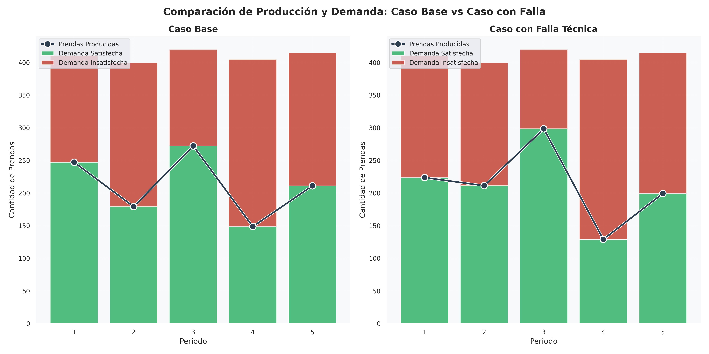
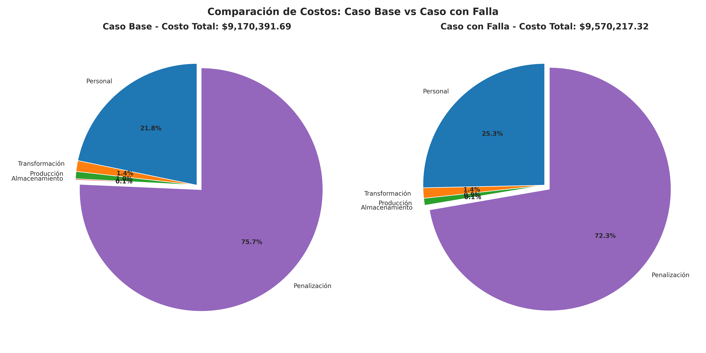
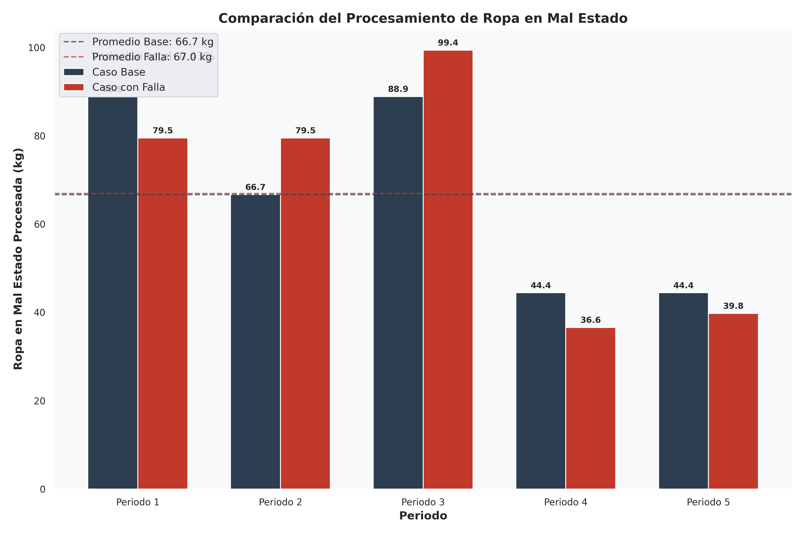

# Análisis Comparativo: Impacto de la Falla Técnica

## Introducción

Este análisis compara los resultados del modelo base con los resultados obtenidos tras la falla técnica que aumentó en un $25\%$ el tiempo requerido para procesar cada kilogramo de ropa en mal estado.

## Tablas Comparativas

### 1. Planificación de Producción y Procesamiento

|  Periodo  |   Caso    | Ropa buen estado (kg) | Ropa mal estado (kg) | Género utilizado (kg) | Prendas producidas | Demanda satisfecha | Demanda insatisfecha |
| :-------: | :-------: | :-------------------: | :------------------: | :-------------------: | :----------------: | :----------------: | :------------------: |
|     1     |   Base    |         $10.00$         |        $88.89$         |         $88.89$         |       $247.22$       |       $247.22$       |        $162.78$        |
|     1     |   Falla   |         $10.00$         |        $79.50$         |         $79.50$         |       $223.76$       |       $223.76$       |        $186.24$        |
|     2     |   Base    |         $5.00$          |        $66.67$         |         $66.67$         |       $179.17$       |       $179.17$       |        $220.83$        |
|     2     |   Falla   |         $5.00$          |        $79.50$         |         $79.50$         |       $211.26$       |       $211.26$       |        $188.74$        |
|     3     |   Base    |         $20.00$          |        $88.89$         |         $88.89$         |       $272.22$       |       $272.22$       |        $147.78$        |
|     3     |   Falla   |         $20.00$          |        $99.38$        |        $99.38$         |       $298.45$       |       $298.45$       |        $121.55$        |
|     4     |   Base    |         $15.00$          |        $44.44$         |         $44.44$         |       $148.61$       |       $148.61$       |        $256.39$        |
|     4     |   Falla   |         $15.00$          |        $36.61$         |         $36.61$         |       $129.04$       |       $129.04$       |        $275.96$        |
|     5     |   Base    |         $40.00$          |        $44.44$         |         $44.44$         |       $211.11$       |       $211.11$       |        $203.89$        |
|     5     |   Falla   |         $40.00$          |        $39.75$         |         $39.75$         |       $199.38$       |       $199.38$       |        $215.62$        |
| **Total** | **Base**  |       **$90.00$**       |      **$333.33$**      |      **$333.33$**       |    **$1058.33$**     |    **$1058.33$**     |      **$991.67$**      |
| **Total** | **Falla** |       **$90.00$**       |      **$334.75$**      |      **$334.75$**       |    **$1061.88$**     |    **$1061.88$**     |      **$988.12$**      |

### 2. Inventarios por Periodo

| Periodo | Caso  | Inv. ropa buen estado (kg) | Inv. ropa mal estado (kg) | Inv. género (kg) | Almacenamiento total (kg) | % Capacidad utilizada |
| :-----: | :---: | :------------------------: | :-----------------------: | :--------------: | :-----------------------: | :-------------------: |
|    1    | Base  |            $0.00$            |           $6.11$            |       $0.00$       |           $6.11$            |         $1.33$          |
|    1    | Falla |            $0.00$            |           $15.50$           |       $0.00$       |           $15.50$           |         $3.37$          |
|    2    | Base  |            $0.00$            |           $4.44$            |       $0.00$       |           $4.44$            |         $0.97$          |
|    2    | Falla |            $0.00$            |           $0.99$            |       $0.00$       |           $0.99$            |         $0.22$          |
|    3    | Base  |            $0.00$            |           $15.56$           |       $0.00$       |           $15.56$           |         $3.38$          |
|    3    | Falla |            $0.00$            |           $1.61$            |       $0.00$       |           $1.61$            |         $0.35$          |
|    4    | Base  |            $0.00$            |           $6.11$            |       $0.00$       |           $6.11$            |         $1.33$          |
|    4    | Falla |            $0.00$            |           $0.00$            |       $0.00$       |           $0.00$            |         $0.00$          |
|    5    | Base  |            $0.00$            |           $1.67$            |       $0.00$       |           $1.67$            |         $0.36$          |
|    5    | Falla |            $0.00$            |           $0.25$            |       $0.00$       |           $0.25$            |         $0.05$          |

### 3. Recursos Humanos y Utilización

|  Periodo  |   Caso    | Trabajadores contratados | Trabajadores por boleta | Total trabajadores | Horas disponibles | Horas utilizadas | % Utilización |
| :-------: | :-------: | :----------------------: | :---------------------: | :----------------: | :---------------: | :--------------: | :-----------: |
|     1     |   Base    |            $2$             |            $2$            |         $4$          |       $32.00$       |      $32.00$       |    $100.00$     |
|     1     |   Falla   |            $2$             |            $2$            |         $4$          |       $32.00$       |      $32.00$       |    $100.00$     |
|     2     |   Base    |            $2$             |            $1$            |         $3$          |       $24.00$       |      $24.00$       |    $100.00$     |
|     2     |   Falla   |            $2$             |            $2$            |         $4$          |       $32.00$       |      $32.00$       |    $100.00$     |
|     3     |   Base    |            $2$             |            $2$            |         $4$          |       $32.00$       |      $32.00$       |    $100.00$     |
|     3     |   Falla   |            $2$             |            $3$            |         $5$          |       $40.00$       |      $40.00$       |    $100.00$     |
|     4     |   Base    |            $2$             |            $0$            |         $2$          |       $16.00$       |      $16.00$       |    $100.00$     |
|     4     |   Falla   |            $2$             |            $0$            |         $2$          |       $16.00$       |      $14.74$       |    $92.11$     |
|     5     |   Base    |            $2$             |            $0$            |         $2$          |       $16.00$       |      $16.00$       |    $100.00$     |
|     5     |   Falla   |            $2$             |            $0$            |         $2$          |       $16.00$       |      $16.00$       |    $100.00$     |
| **Total** | **Base**  |          **$10$**          |          **$5$**          |       **$15$**       |    **$120.00$**     |    **$120.00$**    |  **$100.00$**   |
| **Total** | **Falla** |          **$10$**          |          **$7$**          |       **$17$**       |    **$136.00$**     |    **$134.74$**    |  **$99.07$**   |

### 4. Desglose de Costos

|              Componente               |    Caso Base     |             |    Caso Falla    |             | Variación  |
| :-----------------------------------: | :--------------: | :---------: | :--------------: | :---------: | :--------: |
|                                       |    Valor ($)     | Porcentaje  |    Valor ($)     | Porcentaje  | Porcentual |
|          Personal contratado          |    $920,000.00$    |   $10.03\%$    |    $920,000.00$    |    $9.61\%$    |   $0.0\%$    |
|          Personal por boleta          |   $1,075,000.00$   |   $11.72\%$    |   $1,505,000.00$   |   $15.73\%$    |  $40.00\%$   |
|        Transformación a género        |    $131,666.67$    |    $1.44\%$    |    $132,226.86$    |    $1.38\%$    |   $0.43\%$   |
|         Producción de prendas         |    $88,333.33$     |    $0.96\%$    |    $88,709.16$     |    $0.93\%$    |   $0.43\%$   |
|            Almacenamiento             |    $13,725.00$     |    $0.15\%$    |    $7,433.38$     |    $0.08\%$    |  $-45.84\%$   |
| Penalización por demanda insatisfecha |   $6,941,666.69$   |   $75.70\%$    |   $6,916,847.91$   |   $72.27\%$    |   $-0.36\%$   |
|            **Costo total**            | **$9,170,391.69$** | **$100\%$** | **$9,570,217.32$** | **$100\%$** | **$4.36\%$** |

## Impacto en Indicadores Clave

### 1. Costo Total

- Caso base: $9,170,391.69$
- Caso con falla: $9,570,217.32$
- Variación: $+4.36\%$

### 2. Procesamiento de Ropa en Mal Estado
- Caso base: $333.33$ kg
- Caso con falla: $334.75$ kg
- Variación: $+0.43\%$

### 3. Demanda Insatisfecha
- Caso base: $991.67$ prendas
- Caso con falla: $988.12$ prendas
- Variación: $-0.36\%$

### 4. Utilización de Personal
- Caso base: $5$ trabajadores por boleta en total
- Caso con falla: $7$ trabajadores por boleta en total
- Variación: $+40.00\%$

## Gráficos Comparativos

### Comparación de Producción vs Demanda

*Figura 1: Comparación de la producción y demanda entre el caso base y el caso con falla técnica.*

### Comparación de Recursos Humanos

*Figura 2: Comparación de la utilización de recursos humanos entre el caso base y el caso con falla técnica.*

### Comparación de Costos

*Figura 3: Comparación de los costos totales y su distribución entre el caso base y el caso con falla técnica.*

### Comparación de Procesamiento de Ropa en Mal Estado

*Figura 4: Comparación del procesamiento de ropa en mal estado entre el caso base y el caso con falla técnica.*

## Análisis Detallado

### Impacto en la Capacidad de Producción
La falla técnica que aumentó el tiempo de procesamiento en un 25% ha tenido los siguientes efectos en la capacidad productiva del sistema:

1. **Eficiencia del Proceso**: El aumento en el tiempo de procesamiento ha resultado en un aumento del $0.43\%$ en la cantidad de ropa en mal estado procesada.

2. **Satisfacción de la Demanda**: La demanda insatisfecha ha disminuido en un $0.36\%$, reflejando una mayor capacidad para cumplir con los requerimientos.

3. **Costos Operativos**: El costo total de operación se ha incrementado en un $4.36\%$, principalmente debido a mayores costos de personal y penalizaciones.

### Adaptación de la Estrategia Operativa

El modelo ha respondido a la falla técnica mediante:

1. **Ajuste de Personal**: Aumentó la contratación de trabajadores por boleta en un $40.00\%$ para compensar la pérdida de eficiencia.

2. **Gestión de Inventarios**: Se optimizó el uso de inventarios para mantener la eficiencia operativa.

## Conclusiones

1. La falla técnica ha tenido un impacto moderado en el costo total de operación.

2. El sistema ha mostrado resiliencia para adaptarse a la reducción en la eficiencia del procesamiento.

3. Las principales consecuencias se observan en:
   - El aumento del costo total ($+4.36\%$)
   - La disminución de la demanda insatisfecha ($-0.36\%$)
   - La mayor necesidad de personal ($+40.00\%$)

## Recomendaciones

1. Evaluar la posibilidad de reparar la máquina para recuperar la eficiencia original del proceso.

2. Mantener los niveles actuales de personal que han demostrado ser efectivos.

3. Continuar con la política actual de gestión de inventarios que ha demostrado ser eficiente.
