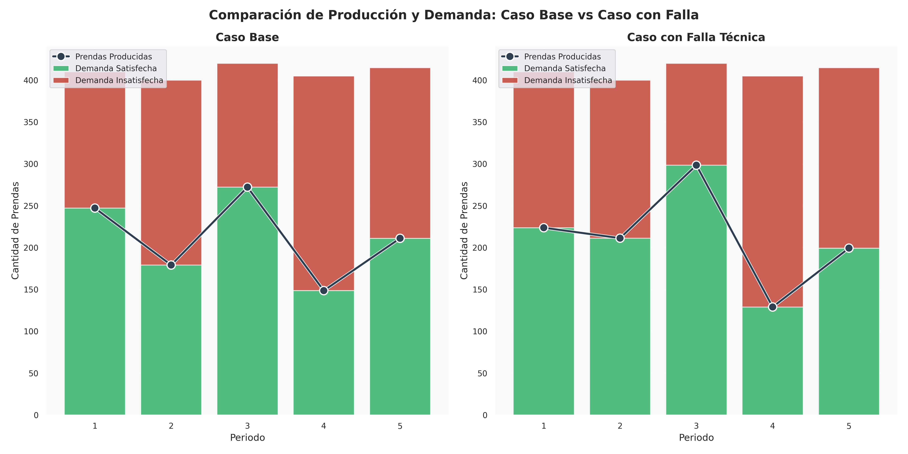
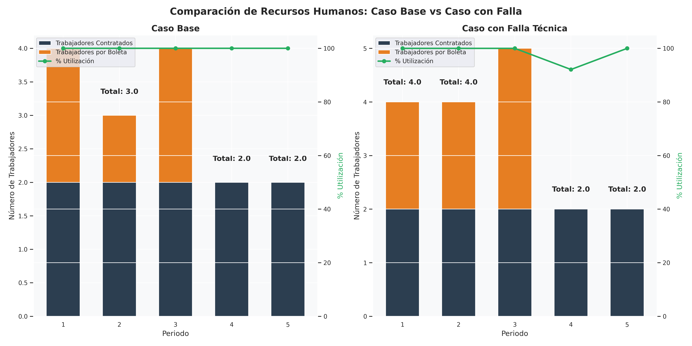

# Análisis Comparativo: Impacto de la adquisicion Técnica

## Introducción

Este análisis compara los resultados del modelo base con los resultados obtenidos tras la adquisicion técnica que aumentó en un $25\%$ el tiempo requerido para procesar cada kilogramo de ropa en mal estado.

## Tablas Comparativas

### 1. Planificación de Producción y Procesamiento

|  Periodo  |   Caso    | Ropa buen estado (kg) | Ropa mal estado (kg) | Género utilizado (kg) | Prendas producidas | Demanda satisfecha | Demanda insatisfecha |
| :-------: | :-------: | :-------------------: | :------------------: | :-------------------: | :----------------: | :----------------: | :------------------: |
|     1     |   Base    |         $10.00$         |        $88.89$         |         $88.89$         |       $247.22$       |       $247.22$       |        $162.78$        |
|     1     |   adquisicion   |         $7.33$         |        $60.20$         |         $156.67$         |       $410.00$       |       $410.00$       |        $0.00$        |
|     2     |   Base    |         $5.00$          |        $66.67$         |         $66.67$         |       $179.17$       |       $179.17$       |        $220.83$        |
|     2     |   adquisicion   |         $0.00$          |        $56.47$         |         $160.00$         |       $400.00$       |       $400.00$       |        $0.00$        |
|     3     |   Base    |         $20.00$          |        $88.89$         |         $88.89$         |       $272.22$       |       $272.22$       |        $147.78$        |
|     3     |   adquisicion   |         $27.67$          |        $133.33$        |        $133.33$         |       $402.50$       |       $402.50$       |        $17.50$        |
|     4     |   Base    |         $15.00$          |        $44.44$         |         $44.44$         |       $148.61$       |       $148.61$       |        $256.39$        |
|     4     |   adquisicion   |         $15.00$          |        $44.44$         |         $44.44$         |       $148.61$       |       $148.61$       |        $256.39$        |
|     5     |   Base    |         $40.00$          |        $44.44$         |         $44.44$         |       $211.11$       |       $211.11$       |        $203.89$        |
|     5     |   adquisicion   |         $40.00$          |        $40.56$         |         $40.56$         |       $201.39$       |       $201.39$       |        $213.61$        |
| **Total** | **Base**  |       **$90.00$**       |      **$333.33$**      |      **$333.33$**       |    **$1058.33$**     |    **$1058.33$**     |      **$991.67$**      |
| **Total** | **adquisicion** |       **$90.00$**       |      **$335.00$**      |      **$535.00$**       |    **$1562.50$**     |    **$1562.50$**     |      **$487.50$**      |

### 2. Inventarios por Periodo

| Periodo | Caso  | Inv. ropa buen estado (kg) | Inv. ropa mal estado (kg) | Inv. género (kg) | Almacenamiento total (kg) | % Capacidad utilizada |
| :-----: | :---: | :------------------------: | :-----------------------: | :--------------: | :-----------------------: | :-------------------: |
|    1    | Base  |            $0.00$            |           $6.11$            |       $0.00$       |           $6.11$            |         $1.33$          |
|    1    | adquisicion |            $2.67$            |           $34.80$           |       $103.53$       |           $141.00$           |         $30.65$          |
|    2    | Base  |            $0.00$            |           $4.44$            |       $0.00$       |           $4.44$            |         $0.97$          |
|    2    | adquisicion |            $7.67$            |           $43.33$            |       $0.00$       |           $51.00$            |         $11.09$          |
|    3    | Base  |            $0.00$            |           $15.56$           |       $0.00$       |           $15.56$           |         $3.38$          |
|    3    | adquisicion |            $0.00$            |           $10.00$            |       $0.00$       |           $10.00$            |         $2.17$          |
|    4    | Base  |            $0.00$            |           $6.11$            |       $0.00$       |           $6.11$            |         $1.33$          |
|    4    | adquisicion |            $0.00$            |           $0.56$            |       $0.00$       |           $0.56$            |         $0.12$          |
|    5    | Base  |            $0.00$            |           $1.67$            |       $0.00$       |           $1.67$            |         $0.36$          |
|    5    | adquisicion |            $0.00$            |           $0.00$            |       $0.00$       |           $0.00$            |         $0.00$          |

### 3. Recursos Humanos y Utilización

|  Periodo  |   Caso    | Trabajadores contratados | Trabajadores por boleta | Total trabajadores | Horas disponibles | Horas utilizadas | % Utilización |
| :-------: | :-------: | :----------------------: | :---------------------: | :----------------: | :---------------: | :--------------: | :-----------: |
|     1     |   Base    |            $2$             |            $2$            |         $4$          |       $32.00$       |      $32.00$       |    $100.00$     |
|     1     |   adquisicion   |            $2$             |            $3$            |         $5$          |       $40.00$       |      $42.56$       |    $106.40$     |
|     2     |   Base    |            $2$             |            $1$            |         $3$          |       $24.00$       |      $24.00$       |    $100.00$     |
|     2     |   adquisicion   |            $2$             |            $3$            |         $5$          |       $40.00$       |      $42.40$       |    $106.00$     |
|     3     |   Base    |            $2$             |            $2$            |         $4$          |       $32.00$       |      $32.00$       |    $100.00$     |
|     3     |   adquisicion   |            $2$             |            $4$            |         $6$          |       $48.00$       |      $53.67$       |    $111.81$     |
|     4     |   Base    |            $2$             |            $0$            |         $2$          |       $16.00$       |      $16.00$       |    $100.00$     |
|     4     |   adquisicion   |            $2$             |            $0$            |         $2$          |       $16.00$       |      $17.89$       |    $111.81$     |
|     5     |   Base    |            $2$             |            $0$            |         $2$          |       $16.00$       |      $16.00$       |    $100.00$     |
|     5     |   adquisicion   |            $2$             |            $0$            |         $2$          |       $16.00$       |      $16.32$       |    $102.02$     |
| **Total** | **Base**  |          **$10$**          |          **$5$**          |       **$15$**       |    **$120.00$**     |    **$120.00$**    |  **$100.00$**   |
| **Total** | **adquisicion** |          **$10$**          |          **$10$**          |       **$20$**       |    **$160.00$**     |    **$172.84$**    |  **$108.02$**   |

### 4. Desglose de Costos

|              Componente               |    Caso Base     |             |    Caso adquisicion    |             | Variación  |
| :-----------------------------------: | :--------------: | :---------: | :--------------: | :---------: | :--------: |
|                                       |    Valor ($)     | Porcentaje  |    Valor ($)     | Porcentaje  | Porcentual |
|          Personal contratado          |    $920,000.00$    |   $10.03\%$    |    $920,000.00$    |    $11.30\%$    |   $0.0\%$    |
|          Personal por boleta          |   $1,075,000.00$   |   $11.72\%$    |   $2,150,000.00$   |   $26.42\%$    |  $100.00\%$   |
|        Transformación a género        |    $131,666.67$    |    $1.44\%$    |    $132,325.00$    |    $1.63\%$    |   $0.50\%$   |
|         Producción de prendas         |    $88,333.33$     |    $0.96\%$    |    $141,775.00$     |    $1.74\%$    |   $60.50\%$   |
|            Almacenamiento             |    $13,725.00$     |    $0.15\%$    |    $82,035.00$     |    $1.01\%$    |  $497.70\%$   |
| Penalización por demanda insatisfecha |   $6,941,666.69$   |   $75.70\%$    |   $3,412,500.00$   |   $41.93\%$    |   $-50.84\%$   |
|            **Costo total**            | **$9,170,391.69$** | **$100\%$** | **$8,138,635.00$** | **$100\%$** | **$-11.25\%$** |

## Impacto en Indicadores Clave

### 1. Costo Total

- Caso base: $9,170,391.69$
- Caso con adquisicion: $8,138,635.00$
- Variación: $-11.25\%$

### 2. Procesamiento de Ropa en Mal Estado
- Caso base: $333.33$ kg
- Caso con adquisicion: $335.00$ kg
- Variación: $+0.50\%$

### 3. Demanda Insatisfecha
- Caso base: $991.67$ prendas
- Caso con adquisicion: $487.50$ prendas
- Variación: $-50.84\%$

### 4. Utilización de Personal
- Caso base: $5$ trabajadores por boleta en total
- Caso con adquisicion: $10$ trabajadores por boleta en total
- Variación: $+100.00\%$

## Gráficos Comparativos

### Comparación de Producción vs Demanda

*Figura 1: Comparación de la producción y demanda entre el caso base y el caso con adquisicion técnica.*

### Comparación de Recursos Humanos

*Figura 2: Comparación de la utilización de recursos humanos entre el caso base y el caso con adquisicion técnica.*

### Comparación de Costos

*Figura 3: Comparación de los costos totales y su distribución entre el caso base y el caso con adquisicion técnica.*

### Comparación de Procesamiento de Ropa en Mal Estado

*Figura 4: Comparación del procesamiento de ropa en mal estado entre el caso base y el caso con adquisicion técnica.*

## Análisis Detallado

### Impacto en la Capacidad de Producción
La adquisicion técnica que aumentó el tiempo de procesamiento en un 25% ha tenido los siguientes efectos en la capacidad productiva del sistema:

1. **Eficiencia del Proceso**: El aumento en el tiempo de procesamiento ha resultado en un aumento del $0.50\%$ en la cantidad de ropa en mal estado procesada.

2. **Satisfacción de la Demanda**: La demanda insatisfecha ha disminuido en un $50.84\%$, reflejando una mayor capacidad para cumplir con los requerimientos.

3. **Costos Operativos**: El costo total de operación se ha reducido en un $11.25\%$, principalmente debido a ajustes en la estrategia de producción.

### Adaptación de la Estrategia Operativa

El modelo ha respondido a la adquisicion técnica mediante:

1. **Ajuste de Personal**: Aumentó la contratación de trabajadores por boleta en un $100.00\%$ para compensar la pérdida de eficiencia.

2. **Gestión de Inventarios**: Se mantuvo una política de inventarios más conservadora.

## Conclusiones

1. La adquisicion técnica ha tenido un impacto significativo en el costo total de operación.

2. El sistema ha mostrado resiliencia para adaptarse a la reducción en la eficiencia del procesamiento.

3. Las principales consecuencias se observan en:
   - La reducción del costo total ($-11.25\%$)
   - La disminución de la demanda insatisfecha ($-50.84\%$)
   - La mayor necesidad de personal ($+100.00\%$)

## Recomendaciones

1. Mantener las adaptaciones implementadas que han permitido minimizar el impacto de la adquisicion.

2. Mantener los niveles actuales de personal que han demostrado ser efectivos.

3. Revisar y optimizar los procesos de inventario para reducir costos operativos.
