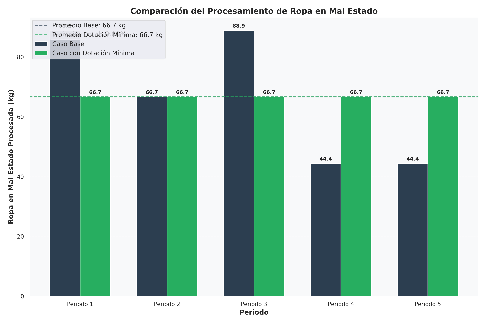

# Análisis Comparativo: Impacto de la Política de Dotación Mínima de Personal

## Introducción

Este análisis compara los resultados del modelo base con los resultados obtenidos tras aplicar la política de dotación mínima de personal que exige mantener un mínimo de $3.0$ trabajadores activos en cada periodo.

## Tablas Comparativas

### 1. Planificación de Producción y Procesamiento

|  Periodo  |   Caso    | Ropa buen estado (kg) | Ropa mal estado (kg) | Género utilizado (kg) | Prendas producidas | Demanda satisfecha | Demanda insatisfecha |
| :-------: | :-------: | :-------------------: | :------------------: | :-------------------: | :----------------: | :----------------: | :------------------: |
|     1     |   Base    |         $10.00$         |        $88.89$         |         $88.89$         |       $247.22$       |       $247.22$       |        $162.78$        |
|     1     |   Dotación   |         $10.00$         |        $66.67$         |         $66.67$         |       $191.67$       |       $191.67$       |        $218.33$        |
|     2     |   Base    |         $5.00$          |        $66.67$         |         $66.67$         |       $179.17$       |       $179.17$       |        $220.83$        |
|     2     |   Dotación   |         $5.00$          |        $66.67$         |         $66.67$         |       $179.17$       |       $179.17$       |        $220.83$        |
|     3     |   Base    |         $20.00$          |        $88.89$         |         $88.89$         |       $272.22$       |       $272.22$       |        $147.78$        |
|     3     |   Dotación   |         $20.00$          |        $66.67$        |        $66.67$         |       $216.67$       |       $216.67$       |        $203.33$        |
|     4     |   Base    |         $15.00$          |        $44.44$         |         $44.44$         |       $148.61$       |       $148.61$       |        $256.39$        |
|     4     |   Dotación   |         $15.00$          |        $66.67$         |         $66.67$         |       $204.17$       |       $204.17$       |        $200.83$        |
|     5     |   Base    |         $40.00$          |        $44.44$         |         $44.44$         |       $211.11$       |       $211.11$       |        $203.89$        |
|     5     |   Dotación   |         $40.00$          |        $66.67$         |         $66.67$         |       $266.67$       |       $266.67$       |        $148.33$        |
| **Total** | **Base**  |       **$90.00$**       |      **$333.33$**      |      **$333.33$**       |    **$1058.33$**     |    **$1058.33$**     |      **$991.67$**      |
| **Total** | **Dotación** |       **$90.00$**       |      **$333.33$**      |      **$333.33$**       |    **$1058.33$**     |    **$1058.33$**     |      **$991.67$**      |

### 2. Inventarios por Periodo

| Periodo | Caso  | Inv. ropa buen estado (kg) | Inv. ropa mal estado (kg) | Inv. género (kg) | Almacenamiento total (kg) | % Capacidad utilizada |
| :-----: | :---: | :------------------------: | :-----------------------: | :--------------: | :-----------------------: | :-------------------: |
|    1    | Base  |            $0.00$            |           $6.11$            |       $0.00$       |           $6.11$            |         $1.33$          |
|    1    | Dotación |            $0.00$            |           $28.33$           |       $0.00$       |           $28.33$           |         $6.16$          |
|    2    | Base  |            $0.00$            |           $4.44$            |       $0.00$       |           $4.44$            |         $0.97$          |
|    2    | Dotación |            $0.00$            |           $26.67$            |       $0.00$       |           $26.67$            |         $5.80$          |
|    3    | Base  |            $0.00$            |           $15.56$           |       $0.00$       |           $15.56$           |         $3.38$          |
|    3    | Dotación |            $0.00$            |           $60.00$            |       $0.00$       |           $60.00$            |         $13.04$          |
|    4    | Base  |            $0.00$            |           $6.11$            |       $0.00$       |           $6.11$            |         $1.33$          |
|    4    | Dotación |            $0.00$            |           $28.33$            |       $0.00$       |           $28.33$            |         $6.16$          |
|    5    | Base  |            $0.00$            |           $1.67$            |       $0.00$       |           $1.67$            |         $0.36$          |
|    5    | Dotación |            $0.00$            |           $1.67$            |       $0.00$       |           $1.67$            |         $0.36$          |

### 3. Recursos Humanos y Utilización

|  Periodo  |   Caso    | Trabajadores contratados | Trabajadores por boleta | Total trabajadores | Horas disponibles | Horas utilizadas | % Utilización |
| :-------: | :-------: | :----------------------: | :---------------------: | :----------------: | :---------------: | :--------------: | :-----------: |
|     1     |   Base    |            $2$             |            $2$            |         $4$          |       $32.00$       |      $32.00$       |    $100.00$     |
|     1     |   Dotación   |            $2$             |            $1$            |         $3$          |       $24.00$       |      $24.00$       |    $100.00$     |
|     2     |   Base    |            $2$             |            $1$            |         $3$          |       $24.00$       |      $24.00$       |    $100.00$     |
|     2     |   Dotación   |            $2$             |            $1$            |         $3$          |       $24.00$       |      $24.00$       |    $100.00$     |
|     3     |   Base    |            $2$             |            $2$            |         $4$          |       $32.00$       |      $32.00$       |    $100.00$     |
|     3     |   Dotación   |            $2$             |            $1$            |         $3$          |       $24.00$       |      $24.00$       |    $100.00$     |
|     4     |   Base    |            $2$             |            $0$            |         $2$          |       $16.00$       |      $16.00$       |    $100.00$     |
|     4     |   Dotación   |            $2$             |            $1$            |         $3$          |       $24.00$       |      $24.00$       |    $100.00$     |
|     5     |   Base    |            $2$             |            $0$            |         $2$          |       $16.00$       |      $16.00$       |    $100.00$     |
|     5     |   Dotación   |            $2$             |            $1$            |         $3$          |       $24.00$       |      $24.00$       |    $100.00$     |
| **Total** | **Base**  |          **$10$**          |          **$5$**          |       **$15$**       |    **$120.00$**     |    **$120.00$**    |  **$100.00$**   |
| **Total** | **Dotación** |          **$10$**          |          **$5$**          |       **$15$**       |    **$120.00$**     |    **$120.00$**    |  **$100.00$**   |

### 4. Desglose de Costos

|              Componente               |    Caso Base     |             |    Caso con Dotación    |             | Variación  |
| :-----------------------------------: | :--------------: | :---------: | :--------------: | :---------: | :--------: |
|                                       |    Valor ($)     | Porcentaje  |    Valor ($)     | Porcentaje  | Porcentual |
|          Personal contratado          |    $920,000.00$    |   $10.03\%$    |    $920,000.00$    |    $9.98\%$    |   $0.0\%$    |
|          Personal por boleta          |   $1,075,000.00$   |   $11.72\%$    |   $1,075,000.00$   |   $11.67\%$    |  $0.00\%$   |
|        Transformación a género        |    $131,666.67$    |    $1.44\%$    |    $131,666.67$    |    $1.43\%$    |   $0.00\%$   |
|         Producción de prendas         |    $88,333.33$     |    $0.96\%$    |    $88,333.33$     |    $0.96\%$    |   $0.00\%$   |
|            Almacenamiento             |    $13,725.00$     |    $0.15\%$    |    $58,725.00$     |    $0.64\%$    |  $327.87\%$   |
| Penalización por demanda insatisfecha |   $6,941,666.69$   |   $75.70\%$    |   $6,941,666.55$   |   $75.33\%$    |   $-0.00\%$   |
|            **Costo total**            | **$9,170,391.69$** | **$100\%$** | **$9,215,391.55$** | **$100\%$** | **$0.49\%$** |

## Impacto en Indicadores Clave

### 1. Costo Total

- Caso base: $9,170,391.69$
- Caso con dotación mínima: $9,215,391.55$
- Variación: $+0.49\%$

### 2. Procesamiento de Ropa en Mal Estado
- Caso base: $333.33$ kg
- Caso con dotación mínima: $333.33$ kg
- Variación: $+0.00\%$

### 3. Demanda Insatisfecha
- Caso base: $991.67$ prendas
- Caso con dotación mínima: $991.67$ prendas
- Variación: $-0.00\%$

### 4. Utilización de Personal
- Caso base: $5$ trabajadores por boleta en total
- Caso con dotación mínima: $5$ trabajadores por boleta en total
- Variación: $+0.00\%$

## Gráficos Comparativos

### Comparación de Producción vs Demanda

*Figura 1: Comparación de la producción y demanda entre el caso base y el caso con dotación mínima de personal.*

### Comparación de Recursos Humanos

*Figura 2: Comparación de la utilización de recursos humanos entre el caso base y el caso con dotación mínima de personal.*

### Comparación de Costos

*Figura 3: Comparación de los costos totales y su distribución entre el caso base y el caso con dotación mínima de personal.*

### Comparación de Procesamiento de Ropa en Mal Estado

*Figura 4: Comparación del procesamiento de ropa en mal estado entre el caso base y el caso con dotación mínima de personal.*

## Análisis Detallado

### Impacto en la Capacidad de Producción

La política de dotación mínima de personal que exige mantener al menos $3.0$ trabajadores activos en cada periodo ha tenido los siguientes efectos en la capacidad productiva del sistema:

1. **Redistribución por Periodos**: Aunque el total de ropa en mal estado procesada se mantiene igual ($333.33$ kg), la restricción de dotación mínima ha modificado significativamente su distribución entre periodos:
   - En el periodo 1: Disminución del procesamiento (de $88.89$ kg a $66.67$ kg)
   - En el periodo 3: Disminución del procesamiento (de $88.89$ kg a $66.67$ kg)
   - En el periodo 4: Aumento del procesamiento (de $44.44$ kg a $66.67$ kg)
   - En el periodo 5: Aumento del procesamiento (de $44.44$ kg a $66.67$ kg)

2. **Redistribución de la Producción de Prendas**: Similar al procesamiento de ropa, la producción de prendas se redistribuye entre periodos, con una notable mejora en el periodo 5 (de $211.11$ a $266.67$ prendas), $reduciendo la demanda insatisfecha en ese periodo de $203.89$ a $148.33$ prendas.

3. **Costos de Almacenamiento**: El costo de almacenamiento aumentó significativamente en un $327.87\%$, debido a que la restricción de dotación mínima fuerza a mantener inventarios más altos entre periodos para optimizar el uso del personal obligatorio.

### Adaptación de la Estrategia Operativa

El modelo ha respondido a la política de dotación mínima de personal mediante:

1. **Ajuste de Personal por Periodo**: En los periodos 4 y 5, donde el caso base utilizaba solo $2.0$ trabajadores, la restricción de dotación mínima fuerza a aumentar a $3.0$ trabajadores, redistribuyendo trabajadores por boleta para mantener el total en $15.0$ trabajadores.

2. **Gestión de Inventarios**: Notablemente, los niveles de inventario de ropa en mal estado aumentaron significativamente:
   - Periodo 1: de $6.11$ kg a $28.33$ kg
   - Periodo 2: de $4.44$ kg a $26.67$ kg
   - Periodo 3: de $15.56$ kg a $60.00$ kg
   - Periodo 4: de $6.11$ kg a $28.33$ kg

## Conclusiones

1. La política de dotación mínima de personal ha tenido un impacto moderado en el costo total de operación ($+0.49\%$), pero ha causado cambios significativos en la estrategia operativa de la fundación.

2. El sistema se ha adaptado a la restricción de dotación mínima principalmente a través de:
   - La redistribución del procesamiento de ropa entre periodos
   - El aumento significativo de los inventarios intermedios
   - El incremento de personal en periodos específicos (4 y 5)

3. Las principales consecuencias observadas son:
   - Aumento drástico de los costos de almacenamiento ($327.87\%$)
   - Redistribución de la producción hacia periodos finales
   - Mantenimiento del nivel total de producción y servicio al cliente
   - Mayor estabilidad laboral al garantizar un mínimo de $3.0$ trabajadores en todos los periodos

## Recomendaciones

1. Evaluar el impacto social y financiero de la política de dotación mínima, considerando el trade-off entre estabilidad laboral y el aumento de costos de almacenamiento.

2. Explorar opciones para optimizar la gestión de inventarios bajo la restricción de dotación mínima, posiblemente mediante mejoras en los espacios de almacenamiento.

3. Considerar políticas de dotación mínima variables por periodo, que podrían reducir costos manteniendo beneficios sociales en periodos críticos.
