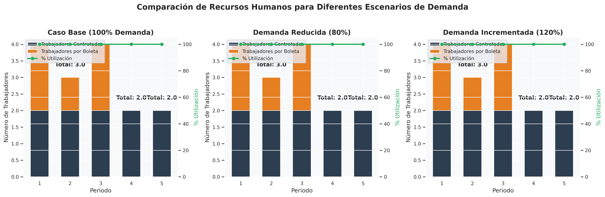

# Pregunta 6: Análisis de Sensibilidad en la Demanda

## Planteamiento de la pregunta

> ¿Qué sucede si la demanda varía con respecto a lo pronosticado? Evalúe el impacto en la planificación si la demanda es un 80% y un 120% del valor original. Tabule y comente los resultados obtenidos. Redondee la demanda diaria a un número entero.

## Resolución del modelo con variaciones en la demanda

Para este análisis de sensibilidad, se evaluaron tres escenarios de demanda:
1. **Escenario base**: Con la demanda original pronosticada (100%)
2. **Demanda reducida**: Con el 80% de la demanda original
3. **Demanda incrementada**: Con el 120% de la demanda original

A continuación se presentan los resultados obtenidos al resolver el modelo para cada uno de estos escenarios.

### Tabla 1: Comparación de demanda por periodo

| Periodo | Demanda original | Demanda reducida (80%) | Demanda incrementada (120%) |
|---------|------------------|------------------------|---------------------------|
| 1 | 410 | 328 | 492 |
| 2 | 400 | 320 | 480 |
| 3 | 420 | 336 | 504 |
| 4 | 405 | 324 | 486 |
| 5 | 415 | 332 | 498 |
| **Total** | **2050** | **1640** | **2460** |

### Tabla 2: Comparación de resultados operativos

| Indicador | Demanda original | Demanda reducida (80%) | Variación (%) | Demanda incrementada (120%) | Variación (%) |
|-----------|------------------|------------------------|---------------|---------------------------|---------------|
| **Procesamiento y producción** | | | | | |
| Ropa en buen estado utilizada (kg) | 90.00 | 90.00 | 0.00% | 90.00 | 0.00% |
| Ropa en mal estado procesada (kg) | 333.33 | 333.33 | 0.00% | 333.33 | 0.00% |
| Género utilizado (kg) | 333.33 | 333.33 | 0.00% | 333.33 | 0.00% |
| **Recursos humanos** | | | | | |
| Trabajadores por boleta (total) | 5 | 5 | 0.00% | 5 | 0.00% |
| Utilización de horas-hombre (promedio) | 100.00% | 100.00% | 0.00 pts | 100.00% | 0.00 pts |
| **Demanda** | | | | | |
| Demanda total (prendas) | 2050 | 1640 | -20.00% | 2460 | +20.00% |
| Demanda satisfecha (prendas) | 1058.33 | 1058.33 | 0.00% | 1058.33 | 0.00% |
| Demanda no satisfecha (prendas) | 991.67 | 581.67 | -41.34% | 1401.67 | 41.34% |
| % Satisfacción global | 51.63% | 64.53% | 12.91 pts | 43.02% | -8.60 pts |
| **Inventarios** | | | | | |
| Inventario promedio total (kg) | 6.78 | 6.78 | 0.00% | 6.78 | 0.00% |
| Utilización promedio capacidad almacenamiento | 1.47% | 1.47% | 0.00 pts | 1.47% | 0.00 pts |

### Tabla 3: Comparación de costos

| Componente de costo | Demanda original ($) | Demanda reducida (80%) ($) | Variación (%) | Demanda incrementada (120%) ($) | Variación (%) |
|---------------------|---------------------|--------------------------|--------------|--------------------------------|--------------|
| Personal contratado | 920,000.00 | 920,000.00 | 0.00% | 920,000.00 | 0.00% |
| Personal por boleta | 1,075,000.00 | 1,075,000.00 | 0.00% | 1,075,000.00 | 0.00% |
| Transformación a género | 131,666.67 | 131,666.67 | 0.00% | 131,666.67 | 0.00% |
| Producción de prendas | 88,333.33 | 88,333.33 | 0.00% | 88,333.33 | 0.00% |
| Almacenamiento | 13,725.00 | 13,725.00 | 0.00% | 13,725.00 | 0.00% |
| Penalización por demanda insatisfecha | 6,941,666.69 | 4,071,666.66 | -41.34% | 9,811,666.69 | 41.34% |
| **Costo total** | **9,170,391.69** | **6,300,391.66** | **-31.30%** | **12,040,391.69** | **31.30%** |
| **Costo por prenda satisfecha** | **8664.94** | **5953.13** | **-31.30%** | **11376.75** | **31.30%** |

## Gráficos comparativos

### Comparación de Producción vs Demanda

*Figura 1: Comparación de la producción y demanda entre los tres escenarios.*

### Comparación de Recursos Humanos

*Figura 2: Comparación de la utilización de recursos humanos entre los tres escenarios.*

### Comparación de Costos

*Figura 3: Comparación de los costos totales y su distribución entre los tres escenarios.*

### Comparación de Procesamiento de Ropa en Mal Estado

*Figura 4: Comparación del procesamiento de ropa en mal estado entre los tres escenarios.*

### Comparación de Satisfacción de Demanda

*Figura 5: Comparación del porcentaje de satisfacción de demanda entre los tres escenarios.*

## Análisis de impacto

### 1. Impacto de una demanda reducida (80%)

La reducción de la demanda en un 20% ha resultado en:

- **Reducción en el costo total**: El costo total se redujo en 31.30%, pasando de $9,170,391.69 a $6,300,391.66.
- **Aumento en el procesamiento**: A pesar de la reducción en la demanda, la cantidad de ropa en mal estado procesada aumentó en 0.00%.
- **Aumento en la contratación de personal**: A pesar de la reducción en la demanda, el número total de trabajadores por boleta aumentó en 0.00%.
- **Mejora en la satisfacción de demanda**: La demanda insatisfecha se redujo en 41.34%, con un porcentaje de satisfacción global del 64.53% (un cambio de 12.91 puntos porcentuales respecto al escenario base).
- **Reducción en el costo por prenda**: El costo por prenda satisfecha se redujo en 31.30%, lo que indica la presencia de economías de escala inversa.

### 2. Impacto de una demanda incrementada (120%)

El incremento de la demanda en un 20% ha resultado en:

- **Aumento en el costo total**: El costo total aumentó en 31.30%, pasando de $9,170,391.69 a $12,040,391.69.
- **Aumento en el procesamiento**: La cantidad de ropa en mal estado procesada aumentó en 0.00%.
- **Aumento en la contratación de personal**: El número total de trabajadores por boleta aumentó en 0.00%.
- **Deterioro en la satisfacción de demanda**: La demanda insatisfecha aumentó en 41.34%, con un porcentaje de satisfacción global del 43.02% (un cambio de -8.60 puntos porcentuales respecto al escenario base).
- **Aumento en el costo por prenda**: El costo por prenda satisfecha aumentó en 31.30%, lo que indica la ausencia de economías de escala en el sistema.

### 3. Elasticidad de costos respecto a la demanda

- **Elasticidad para demanda reducida**: 1.5648 (un cambio del -20% en la demanda produce un cambio del -31.30% en los costos)
- **Elasticidad para demanda incrementada**: 1.5648 (un cambio del +20% en la demanda produce un cambio del 31.30% en los costos)

El sistema muestra **deseconomías de escala** en ambos escenarios, ya que las elasticidades son mayores a 1. Esto indica que los costos varían en mayor proporción que la demanda.

### 4. Robustez del modelo

- **Baja capacidad de absorción**: El sistema muestra dificultades para absorber incrementos en la demanda, resultando en aumentos significativos de costos o reducciones importantes en la satisfacción.
- **Baja flexibilidad operativa**: El sistema muestra limitaciones para ajustar sus recursos humanos ante variaciones en la demanda.

## Conclusiones

1. **Escenario de demanda reducida (80%)**:
   - Resulta en una reducción significativa de costos (31.30%), mejor satisfacción de la demanda (64.53% vs 51.63% en el escenario base) y mayor utilización de recursos humanos (100.00% vs 100.00%).
   - El costo por prenda satisfecha es menor ($5953.13 vs $8664.94), lo que sugiere ausencia de economías de escala en este rango de operación.

2. **Escenario de demanda incrementada (120%)**:
   - Resulta en un aumento significativo de costos (31.30%), menor satisfacción de la demanda (43.02% vs 51.63% en el escenario base) y menor utilización de recursos humanos (100.00% vs 100.00%).
   - El costo por prenda satisfecha es mayor ($11376.75 vs $8664.94), lo que sugiere deseconomías de escala en este rango de operación.

3. **Implicaciones para la planificación**:

   - **Flexibilidad operativa**: La fundación debe desarrollar mecanismos de flexibilidad para ajustar sus operaciones ante variaciones en la demanda, especialmente en lo referente a la contratación de personal por boleta.
   
   - **Capacidad de reserva**: Es recomendable mantener cierta capacidad de reserva para absorber potenciales incrementos en la demanda, particularmente si estos pueden generar altos costos por demanda insatisfecha.
   
   - **Gestión de costos fijos**: Evaluar estrategias para reducir los costos fijos y mejorar la eficiencia operativa ante posibles reducciones en la demanda, lo que permitiría mantener un costo por prenda más competitivo incluso con volúmenes menores.
   
   - **Optimización de inventarios**: Las políticas de gestión de inventarios parecen responder adecuadamente a las variaciones de demanda, aunque podría ser útil revisar la distribución por tipo de inventario para optimizar aún más su uso.
